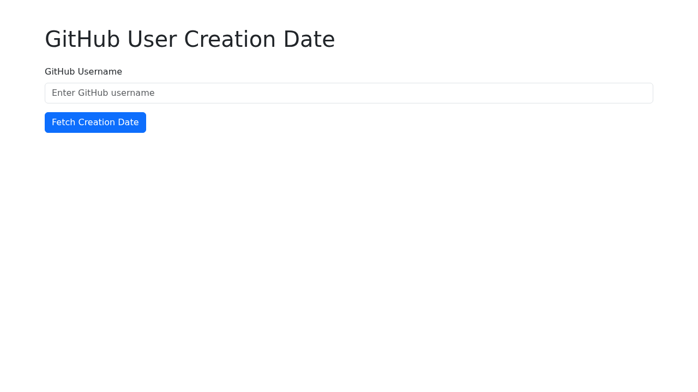

# GitHub User Creation Date Fetcher

This web application allows you to fetch the account creation date of any GitHub user by entering their username. It leverages the GitHub API to retrieve the user's data and displays the `created_at` date in `YYYY-MM-DD UTC` format.

## Features
- Fetch GitHub user creation date.
- Optional support for GitHub Personal Access Token via URL query parameter for increased API rate limits.
- Displays creation date in YYYY-MM-DD UTC format.
- User-friendly interface with Bootstrap 5.

## How to Use
1. Enter a GitHub username in the input field.
2. Click the "Fetch Creation Date" button.
3. The account creation date will be displayed below the form.

### Using a Personal Access Token (Optional)
To use a GitHub Personal Access Token (PAT) for higher API rate limits, append `?token=YOUR_PAT` to the URL. For example:
`https://mayanklearns.github.io/ai-agent-github-user-created-c3d4e/?token=ghp_YOUR_ACTUAL_TOKEN`

## Deployment
- **Repository URL**: `https://github.com/mayanklearns/ai-agent-github-user-created-c3d4e`
- **Live Demo URL**: `https://mayanklearns.github.io/ai-agent-github-user-created-c3d4e/`

## Preview

## License
This project is licensed under the MIT License - see the [LICENSE](LICENSE) file for details.
